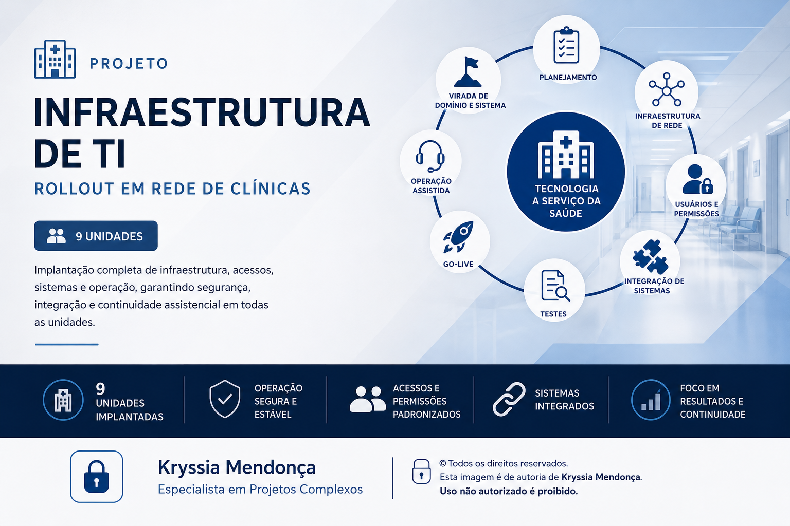
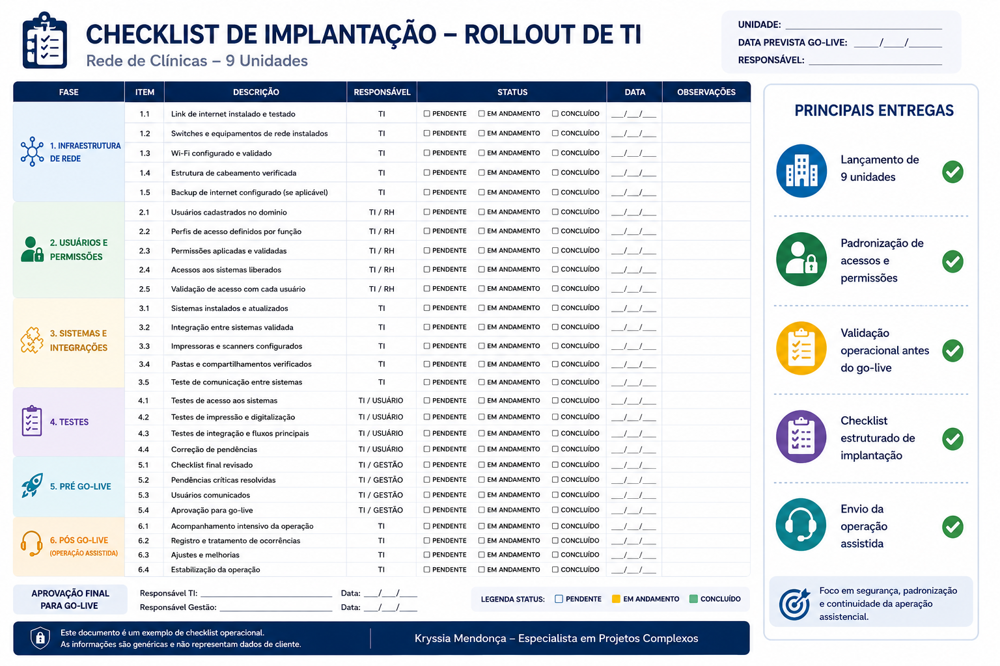
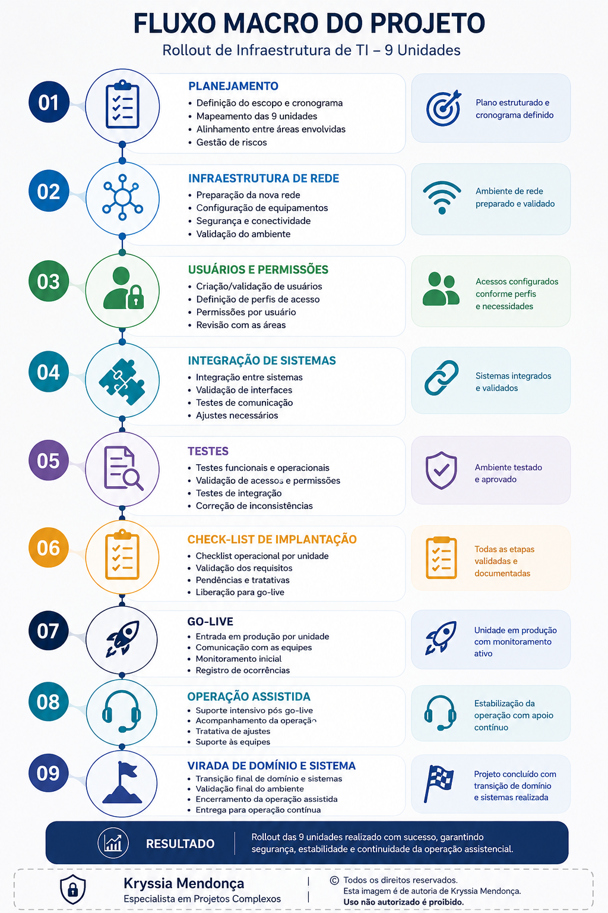

---

## Visão geral
Projeto de rollout de infraestrutura de TI realizado em rede de clínicas de saúde com 9 unidades.

Atuação focada na implantação tecnológica e sustentação operacional durante a transição de ambiente, acessos e sistemas, garantindo continuidade da operação assistencial.

## Objetivo
Planejar e acompanhar a implantação da infraestrutura tecnológica nas unidades, padronizando acessos, sistemas e ambiente operacional para entrada em produção.

## Escopo
- Rollout de 9 unidades
- Preparação da nova rede
- Configuração de usuários
- Definição de permissões por perfil
- Integração entre sistemas
- Planejamento de testes
- Checklist de implantação
- Go-live por unidade
- Operação assistida
- Virada de domínio e sistema

## Minha atuação
- Coordenação das atividades de rollout
- Organização do cronograma e acompanhamento por unidade
- Alinhamento entre times técnicos e operação
- Validação de acessos por usuário
- Apoio em testes antes da entrada em produção
- Gestão de checklist operacional
- Acompanhamento da semana crítica de virada
- Suporte pós-implantação até estabilização
- 
## Checklist Operacional e as principais entregas

## Fluxo do Projeto

## Tecnologias e processos envolvidos
- Infraestrutura de TI
- Gestão de rollout
- Governança operacional
- Gestão de acessos
- Implantação de sistemas
- Acompanhamento de projeto em saúde

## Observação
Projeto descrito com informações anonimizadas para preservar confidencialidade.
